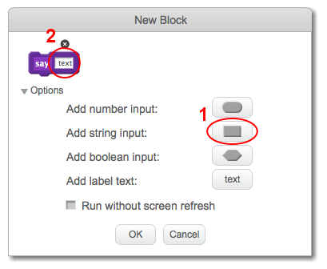
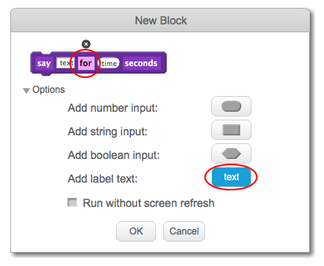

+ Click on **More Blocks** in the Scripts tab, then click on **Make a Block**.

+ You can create blocks that have 'gaps' to add data. These 'gaps' are called **parameters**. To add parameters, click **Options**, then click the type of data you want to add and then give your data a name.

+ If you want to add some text between parameters, you can add label text:

+ You can then define your new block, and use the data by dragging the circular blocks to use them in your code.

+ Now you add data as parameters into the gaps of your new block.

+ Use the new `define` block with the gaps you have filled in by attaching code to it and adding it to your script.

